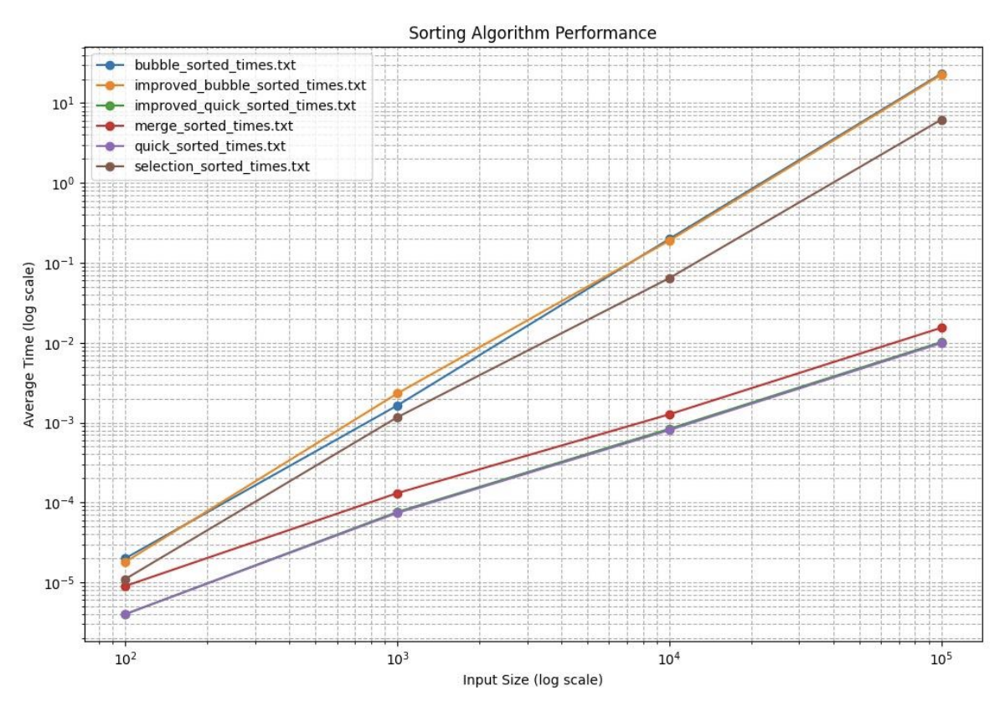

# Sorting Algorithm Performance Analysis

This project is designed to analyze the performance of various sorting algorithms. The analysis includes measuring the time taken by each algorithm to sort arrays of different sizes and visualizing the results. The following sorting algorithms are tested:

- Bubble Sort
- Improved Bubble Sort
- Selection Sort
- Quick Sort
- Improved Quick Sort
- Merge Sort

## Project Structure

The project consists of the following files:

- `sum.sh`: A shell script to consolidate the results from different sorting algorithm runs.
- `run.sh`: A shell script to clear previous outputs, compile the C program, run the sorting algorithms, and plot the results.
- `main.c`: A C program that contains the implementation of the sorting algorithms and the logic to test and log their performance.
- `plot.py`: A Python script to read the consolidated results and plot the performance of the sorting algorithms.
- `clear.sh`: A shell script to clear previous outputs (should be created if not existing).

## Prerequisites

Make sure you have the following installed on your system:

- GCC (GNU Compiler Collection)
- Python 3 with pandas and matplotlib libraries

## Running the Project

1. **Clone the repository** (if applicable) or ensure you have all the necessary files in a directory.

2. **Compile and run the project**:

   ```bash
   sh run.sh
   ```

   This script will:

   - Clear previous outputs
   - Compile the `main.c` file
   - Execute the compiled C program to run sorting algorithms on different array sizes
   - Consolidate the results into a single file
   - Plot the results using the Python script

3. **View the results**:
   - The consolidated results will be stored in `consolidated_results.txt`.
   - The plot showing the performance of the sorting algorithms will be displayed.

## File Details

### `sum.sh`

This script consolidates the results from different sorting algorithm runs into a single file, `consolidated_results.txt`.

### `run.sh`

This script automates the process of compiling the C program, running the sorting tests, consolidating results, and plotting the performance.

### `main.c`

This C program includes the implementation of the sorting algorithms and the logic to test and log their performance. The results of each run are saved to files in the `outputs` directory.

### `plot.py`

This Python script reads the consolidated results from `consolidated_results.txt` and plots the performance of the sorting algorithms using matplotlib.

## Directory Structure

- `outputs/`: Directory containing the output files for each sorting algorithm.
- `sorted/`: Directory to store the sorted arrays (created by the `main.c` program).

## Additional Notes

- Ensure the `outputs` and `sorted` directories exist before running the project.
- Adjust the array sizes in `main.c` if you want to test different input sizes.

## Sample Output

The following is a sample output of the project:

